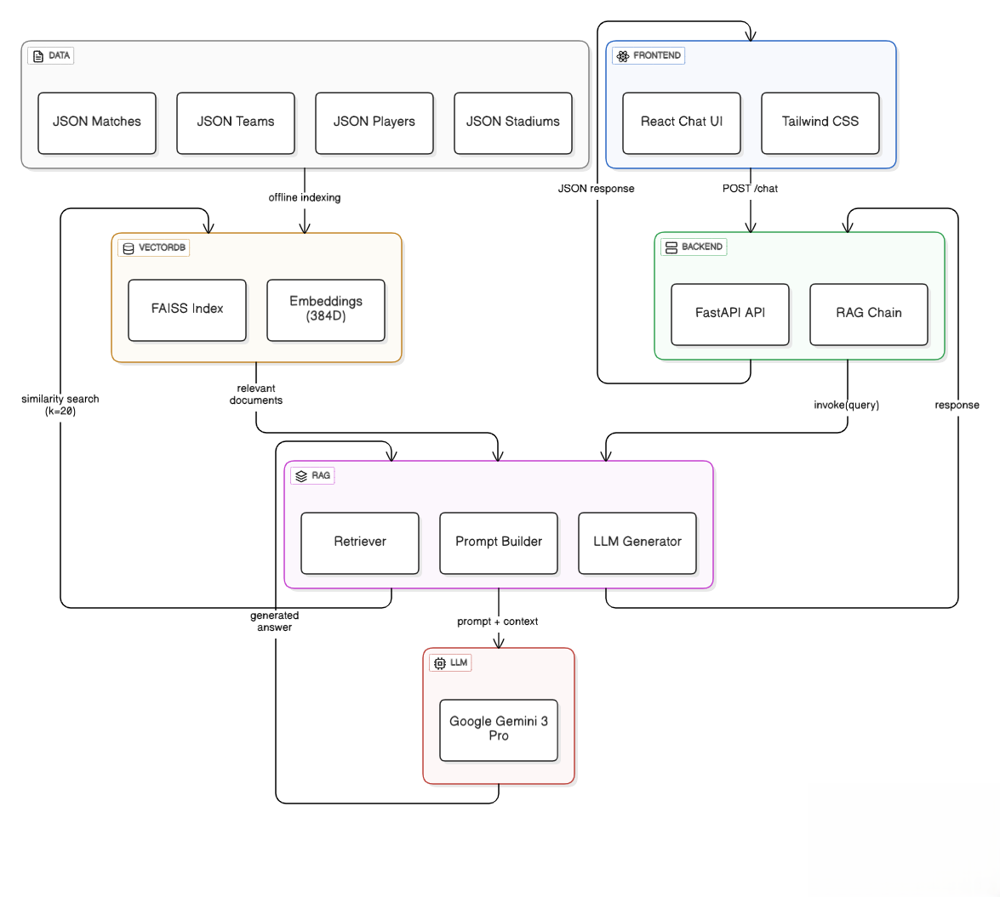

# 🧠 Architecture Générale – ASSAD AI (CAN 2025)

## 1. Description générale

**ASSAD AI – CAN 2025 Assistant** est un système intelligent de question-réponse basé sur l’approche  
**RAG (Retrieval-Augmented Generation)**, conçu pour fournir des réponses **factuelles, cohérentes et contextualisées** sur la Coupe d’Afrique des Nations 2025 organisée au Maroc.

Le système combine :
- une **interface utilisateur web moderne**
- une **API backend performante**
- une **base de données vectorielle**
- un **LLM de dernière génération**

L’objectif principal est d’éviter les hallucinations du modèle en s’appuyant exclusivement sur des **données officielles structurées** (JSON) liées à la CAN 2025.

---

## 2. Vue d’ensemble de l’architecture

Le système est organisé selon une architecture **client–serveur**, avec un pipeline RAG au cœur du traitement.

---
La description détaillée de l’architecture du système est disponible ici :  
➡️ [Voir l’architecture générale](./ARCHITECTURE.md)

## 3. Composants principaux

### 3.1 Frontend (Interface utilisateur)

**Technologies**
- React.js
- Tailwind CSS

**Rôle**
- Fournir une interface de chat interactive
- Envoyer les questions utilisateur au backend via une requête HTTP
- Afficher les réponses générées par l’IA

**Fonctionnement**
- L’utilisateur saisit une question
- Une requête `POST /chat` est envoyée au backend
- La réponse JSON est affichée dans l’interface de chat

---

### 3.2 Backend (API & orchestration)

**Technologies**
- Python
- FastAPI
- LangChain

**Rôle**
- Recevoir les requêtes utilisateur
- Orchestrer la chaîne RAG
- Retourner une réponse finale formatée

**Composants**
- API FastAPI
- Chaîne RAG (Retriever, Prompt Builder, LLM Generator)

---

## 4. Pipeline RAG (Retrieval-Augmented Generation)

Le pipeline RAG est le cœur du système.

### 4.1 Retriever
- Convertit la question utilisateur en embedding
- Effectue une recherche par similarité dans FAISS
- Récupère les **k = 20 documents** les plus pertinents

### 4.2 Prompt Builder
- Assemble les documents récupérés
- Construit un prompt enrichi (question + contexte)
- Garantit que le LLM reste ancré dans les données réelles

### 4.3 LLM Generator
- Envoie le prompt final au modèle de langage
- Génère une réponse en français
- Fonctionne en mode déterministe (temperature = 0)

---

## 5. Base de données vectorielle

### 5.1 FAISS

**Rôle**
- Stocker les embeddings des documents
- Permettre une recherche rapide par similarité sémantique

**Caractéristiques**
- Recherche vectorielle approximative
- Embeddings de dimension **384**
- Très faible latence

---

### 5.2 Embeddings

**Modèle**
- Sentence Transformers – `all-MiniLM-L6-v2`

**Rôle**
- Transformer le texte en vecteurs numériques
- Capturer la sémantique des questions et documents

---

## 6. Sources de données

Les données sont stockées sous forme de fichiers **JSON** :

- Matchs
- Équipes
- Joueurs
- Stades

### Indexation offline
- Les données sont traitées et vectorisées **avant l’exécution**
- L’index FAISS est généré une seule fois
- Aucun recalcul d’embeddings en production

---

## 7. Modèle de langage (LLM)

**Modèle utilisé**
- Google Gemini 3 Pro

**Rôle**
- Génération de réponses en langage naturel
- Exploitation du contexte fourni par le pipeline RAG

**Configuration**
- Temperature = 0 (réponses stables et factuelles)

---

## 8. Flux de données global

1. L’utilisateur pose une question via le frontend
2. Le frontend envoie une requête `POST /chat`
3. Le backend déclenche la chaîne RAG
4. Le retriever interroge FAISS
5. Les documents pertinents sont injectés dans le prompt
6. Le LLM génère une réponse
7. La réponse est renvoyée au frontend

---

## 9. Avantages de cette architecture

- Réduction des hallucinations
- Réponses basées sur des données réelles
- Architecture modulaire et scalable
- Séparation claire des responsabilités
- Facilité de maintenance et d’évolution

---

## 10. Conclusion

Cette architecture garantit un système IA **robuste, fiable et explicable**, parfaitement adapté à un contexte critique comme celui de la **CAN 2025**, où l’exactitude des informations est essentielle.

Elle constitue une base solide pour une application académique, professionnelle ou industrielle intégrant les technologies modernes de l’IA générative.
